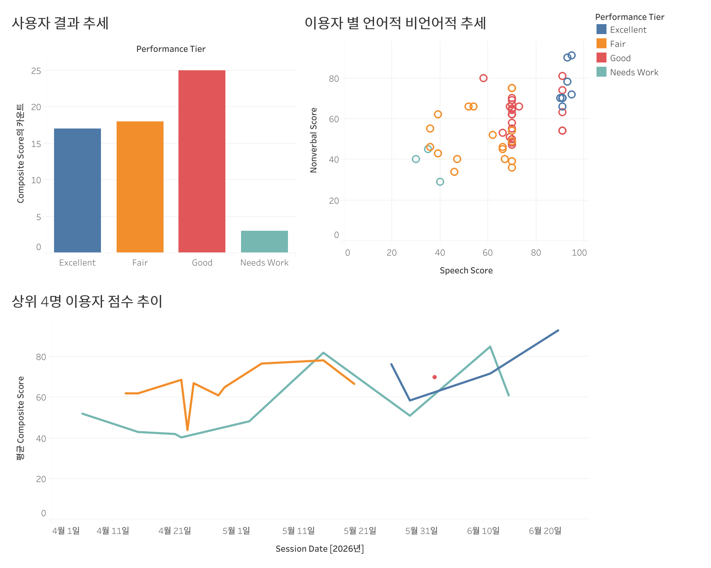

# 🧑‍🏫 Point

> **An AI-powered presentation coaching system that analyzes, corrects, and challenges your presentation in real time.**
> 

---

## 🚨 Problem

- Practicing presentations alone lacks **objective feedback**
- Real-time correction of speech and body language is difficult
- Identifying and improving weak points is inefficient

---

## 💡 Solution

Point solves this by combining:

- **Real-time speech & nonverbal coaching**
- **AI-driven weak point detection**
- **Q&A simulation**
- **Comprehensive performance analytics**

---

## ⚡ Why Point?

- **Low-latency feedback** (rule-based, near 0ms)
- **Multimodal analysis** (speech + vision)
- **Context-aware AI agents** (agents share knowledge)
- **Feedback fatigue control** (priority queue system)

---

## 🌟 Key Features

### 🤖 Multi-Agent System

Each stage of presentation is handled by a specialized agent:

- **Agent 0 (Orchestrator)**: Manages **State Machine** transitions and ensures **Session Recovery**.
- **Agent 1 (Material & Quiz)**: Analyzes PDF/TXT to extract **Summary** and **Weak Areas**.
- **Agent 2 (Speech)**: Real-time **WPM**, **Filler Word** counting, and **Semantic Off-topic** detection.
- **Agent 3 (Nonverbal)**: **MediaPipe**based analysis of **Gaze**, **Posture**, and **Gestures**.
- **Agent 4 (Q&A)**: 5-turn **AI Audience** conducting a **Stress Interview** based on presentation gaps.
- **Agent 5 (Report)**: Aggregates all logs to generate **Composite Scores** and **Natural Language Feedback**.

---

## 🏗 System Architecture

### Overall Flow

```
Upload → Quiz → Presentation → Real-time Coaching → Q&A → Report
```

### Key Design

- **Agent Orchestration** via state machine
- **Web Worker isolation** for nonverbal processing
- **FeedbackQueue** for prioritizing user feedback
- **Shared Session Context** across all agents

---

## 🛠 Tech Stack

### Frontend

- React 18, TypeScript
- Zustand (state management)
- Tailwind CSS

### AI & Analysis

- OpenAI GPT-4o / GPT-4o-mini
- Web Speech API
- MediaPipe (FaceMesh, Pose, Hands)

### Backend & Infra

- Supabase (Auth, PostgreSQL, Storage)
- Vercel (Deployment)

---

## 🎥 Demo

👉 *(Link to be updated)*

---

## 📊 Analytics Dashboard

Session performance data visualized in Tableau Online — tracking score trends, performance tier distribution, and speech vs. nonverbal correlation across all sessions.

[](https://10ay.online.tableau.com/#/site/botw461-20fa7fc994/views/Point_A/1_1)

> 📎 [View live dashboard →](https://10ay.online.tableau.com/#/site/botw461-20fa7fc994/views/Point_A/1_1) *(Tableau Online login required)*

**Charts included:**
- **사용자 결과 추세** — Session count by performance tier (Excellent / Good / Fair / Needs Work)
- **이용자 별 언어적 비언어적 추세** — Speech Score vs. Nonverbal Score scatter plot, colored by tier
- **상위 4명 이용자 점수 추이** — Composite score trend over time per user

---

## ⚙️ Getting Started

```
# Clone
git clone https://github.com/presenPoint/Point.git
cd Point

# Install
npm install

# Environment Variables
VITE_SUPABASE_URL=your_url
VITE_SUPABASE_ANON_KEY=your_key
VITE_OPENAI_API_KEY=your_key

# Run
npm run dev
```

---

## 📂 Project Structure

```
src/
├── agents/        # Agent logic (0~5)
├── components/    # UI components
├── hooks/         # Speech & Media integrations
├── workers/       # Web Worker (nonverbal analysis)
├── lib/           # API clients
```

---

## 🧠 Design Principles

- **Minimize latency** → real-time feedback must feel instant
- **Avoid feedback overload** → only top-priority feedback shown
- **Context continuity** → agents share knowledge across pipeline

---

## 📄 License

MIT License 

