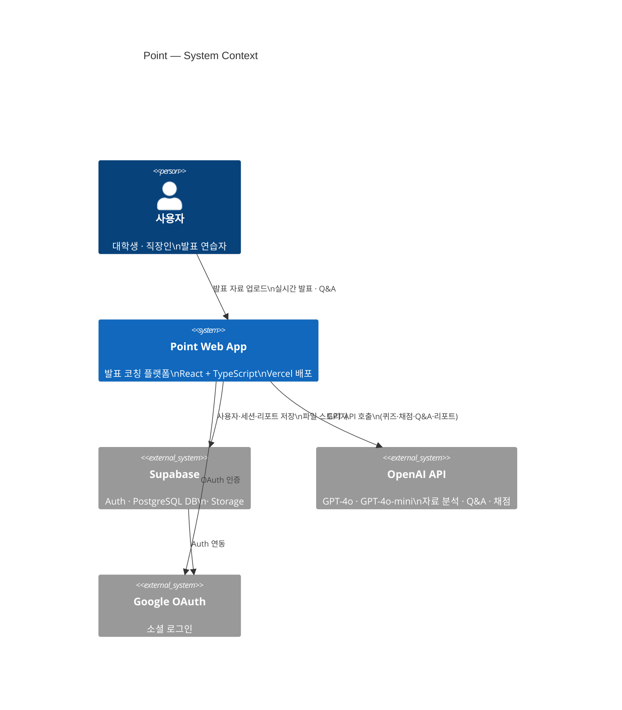
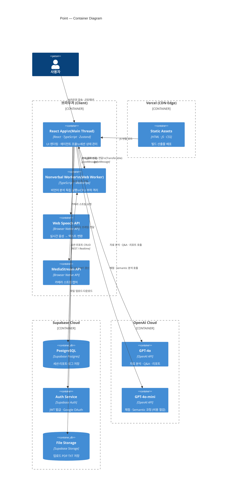
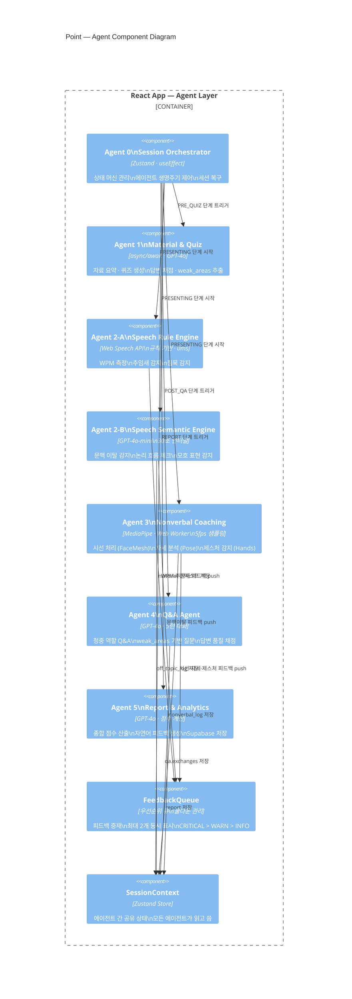
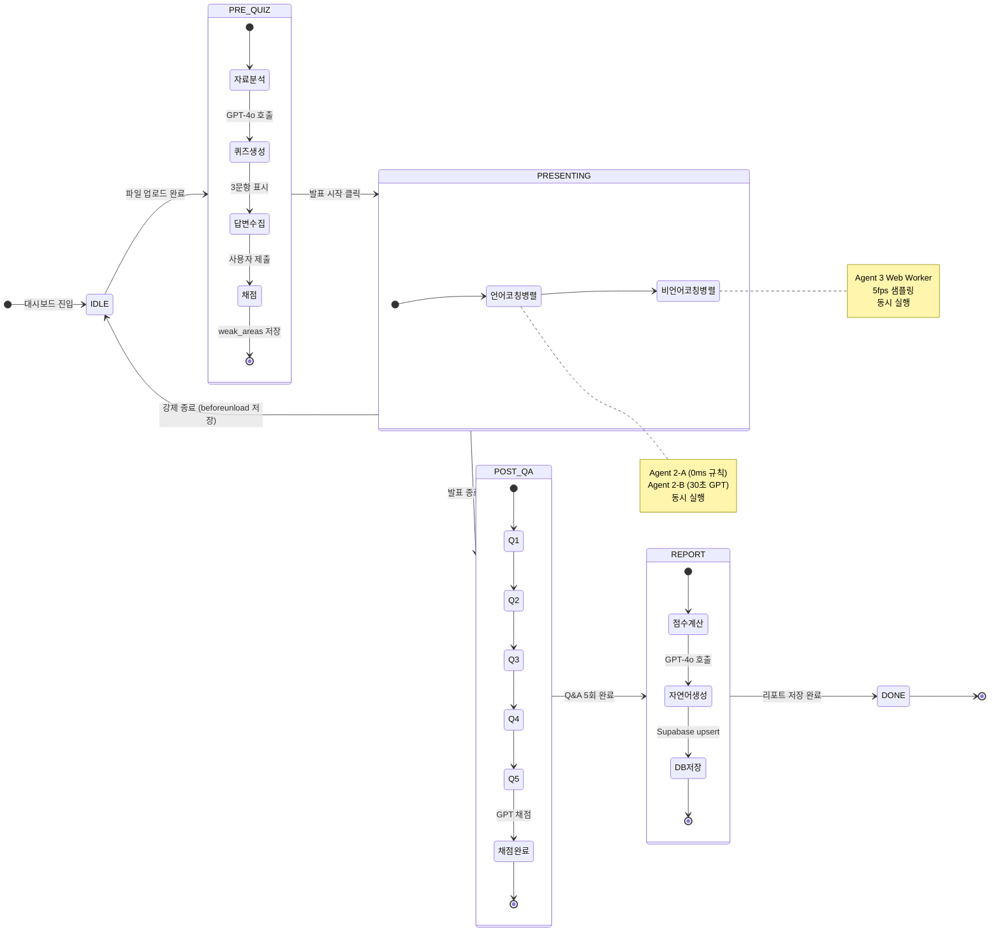
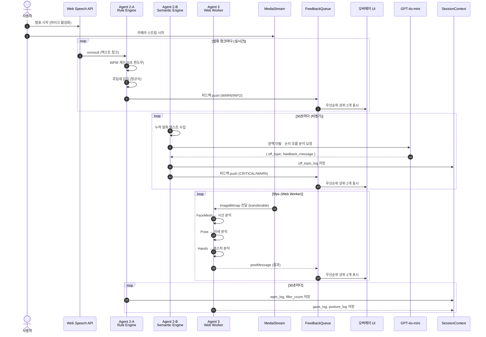
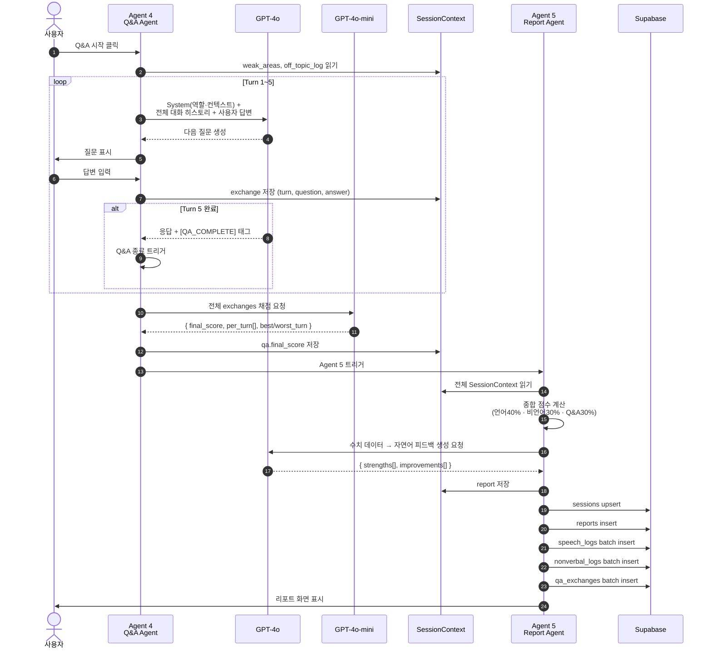
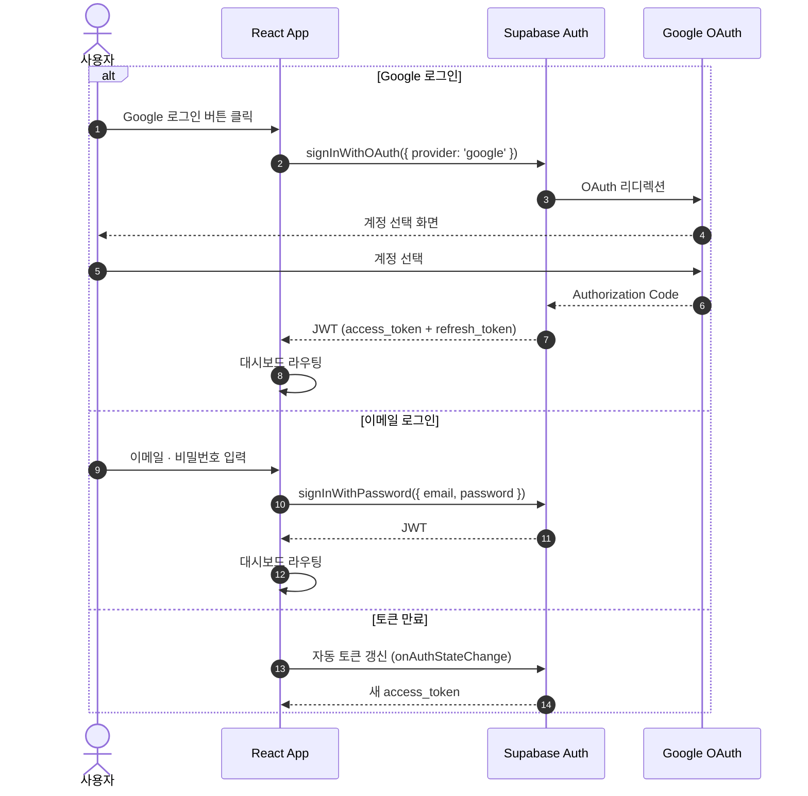
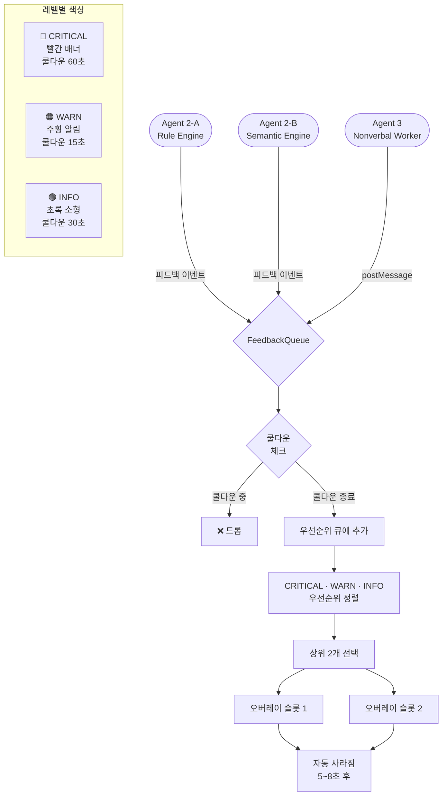
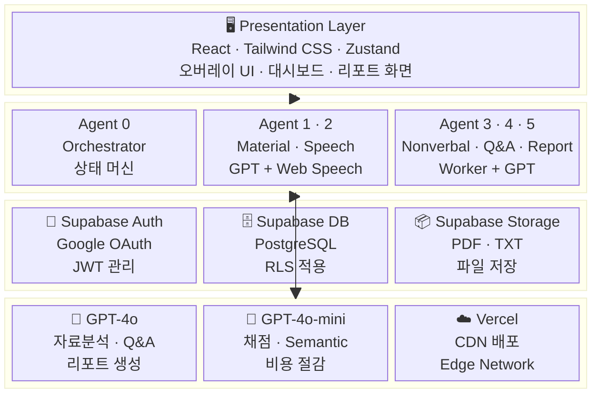

# Point — System Architecture UML

> **문서 버전**: v1.0 · 2026  
> **표기 방식**: Mermaid (C4 Model 영감 · 실용 혼합)

---

## 1. 전체 시스템 컨텍스트 (C4 Level 1)



---

## 2. 컨테이너 다이어그램 (C4 Level 2)



---

## 3. 에이전트 컴포넌트 다이어그램 (C4 Level 3)



---

## 4. 세션 상태 머신



---

## 5. 실시간 발표 중 데이터 흐름 시퀀스



---

## 6. Q&A 세션 시퀀스



---

## 7. 인증 플로우



---

## 8. DB 엔티티 관계도 (ERD)

```mermaid
erDiagram
  USERS {
    uuid    id          PK
    text    email
    timestamp created_at
  }

  SESSIONS {
    uuid      session_id        PK
    uuid      user_id           FK
    timestamp started_at
    timestamp ended_at
    int       total_duration_sec
    smallint  composite_score
    text      status
    timestamp created_at
  }

  FILES {
    uuid      file_id       PK
    uuid      user_id       FK
    uuid      session_id    FK
    text      storage_path
    text      filename
    int       size_bytes
    text      summary
    text[]    keywords
    timestamp uploaded_at
  }

  QUIZ_ITEMS {
    uuid      id          PK
    uuid      session_id  FK
    text      question
    text      user_answer
    smallint  score
    text      feedback
    smallint  turn
  }

  SPEECH_LOGS {
    uuid    id          PK
    uuid    session_id  FK
    bigint  timestamp
    text    type
    jsonb   value
  }

  NONVERBAL_LOGS {
    uuid    id          PK
    uuid    session_id  FK
    bigint  timestamp
    text    type
    jsonb   value
  }

  QA_EXCHANGES {
    uuid      id          PK
    uuid      session_id  FK
    smallint  turn
    text      question
    text      answer
    smallint  score
    text      comment
  }

  REPORTS {
    uuid      session_id      PK FK
    smallint  speech_score
    smallint  nonverbal_score
    smallint  qa_score
    smallint  composite_score
    text[]    strengths
    text[]    improvements
    timestamp generated_at
  }

  USERS         ||--o{ SESSIONS      : "has"
  USERS         ||--o{ FILES         : "uploads"
  SESSIONS      ||--o{ FILES         : "uses"
  SESSIONS      ||--o{ QUIZ_ITEMS    : "contains"
  SESSIONS      ||--o{ SPEECH_LOGS   : "records"
  SESSIONS      ||--o{ NONVERBAL_LOGS: "records"
  SESSIONS      ||--o{ QA_EXCHANGES  : "contains"
  SESSIONS      ||--|| REPORTS       : "produces"
```

---

## 9. FeedbackQueue 우선순위 처리 흐름



---

## 10. 기술 스택 레이어 다이어그램



---

*Point System Architecture UML v1.0 · 2026*
